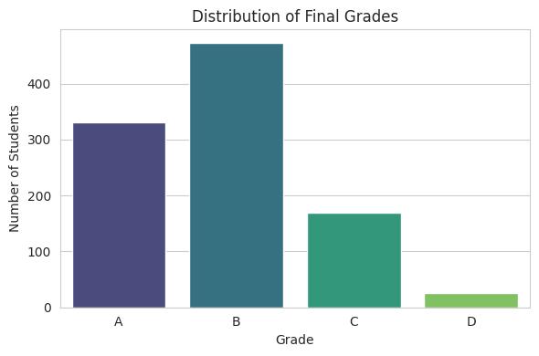
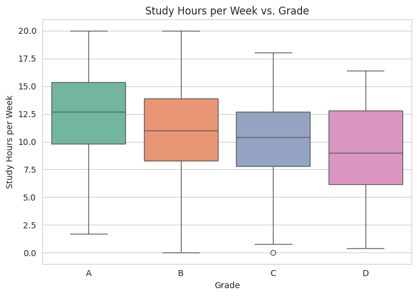
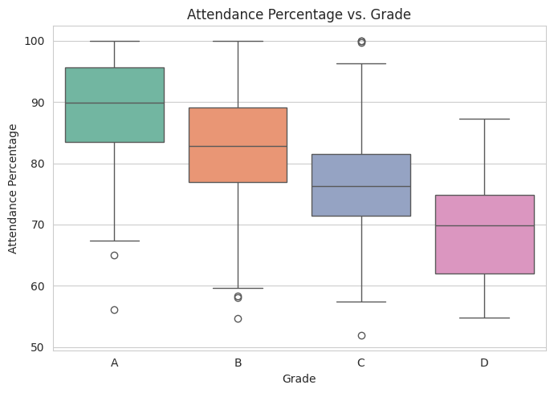
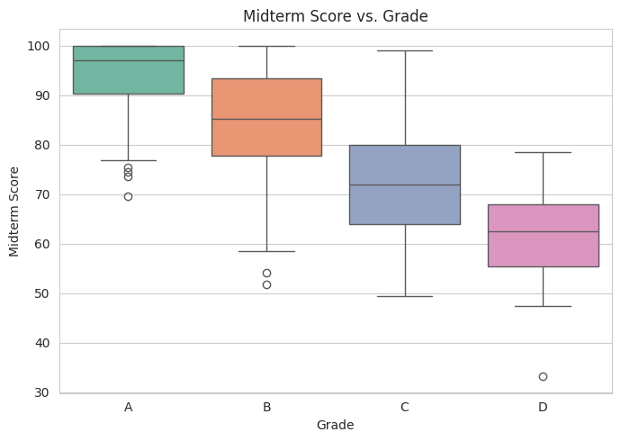
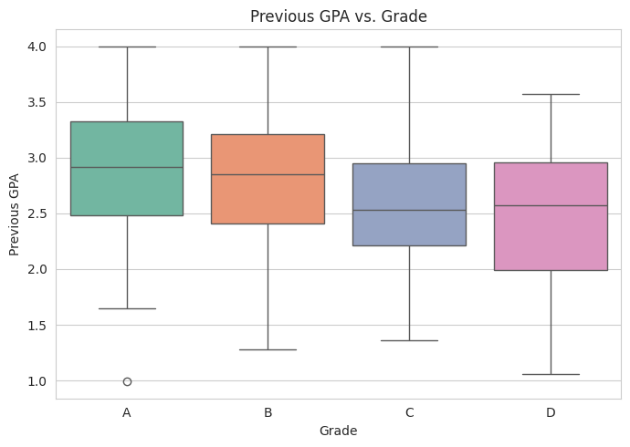
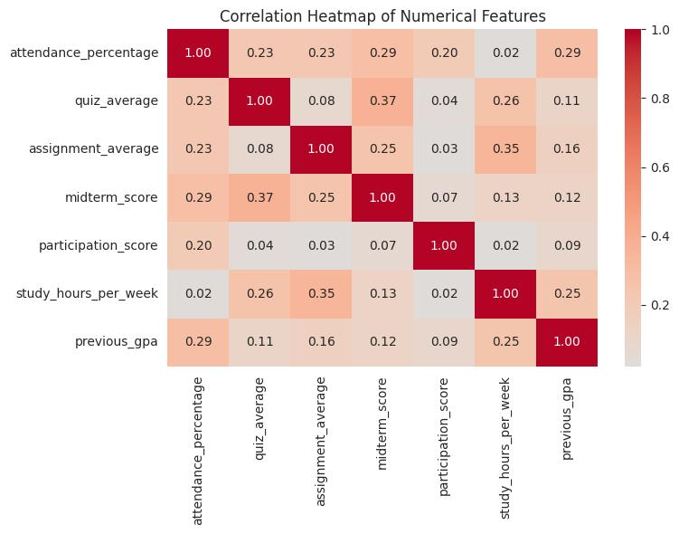
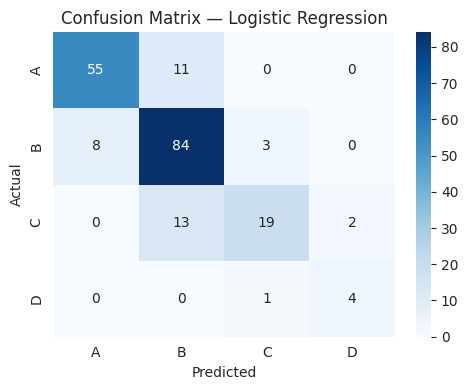

# Student Performance Prediction

This project focuses on analyzing student data and predicting student performance grades based on various demographic, academic, and behavioral features. The dataset was cleaned, explored through data visualization, and subsequently used to train and compare several machine learning classification models.

## What Was Done

1. **Data Preprocessing & Cleaning**: 
   - Handled missing values (imputation for numerical and categorical data).
   - Removed duplicates and irrelevant columns.
   - Encoded categorical variables and standardized numerical features.
2. **Exploratory Data Analysis (EDA)**:
   - Investigated the distribution of grades.
   - Analyzed the relationships between `study_hours_per_week`, `attendance_percentage`, `midterm_score`, `previous_gpa` and the final `grade`.
   - Generated a correlation heatmap to understand multicollinearity.
3. **Machine Learning Modeling**:
   - Developed pipelines incorporating `StandardScaler` and classification models.
   - Trained five models: **Logistic Regression, Random Forest, Support Vector Machine (SVM), K-Nearest Neighbors (KNN), and Naive Bayes**.
   - Evaluated models using Accuracy, Precision, Recall, and F1-score.
4. **Feature Selection Analysis**:
   - Assessed the predictive power of the `previous_gpa` feature by training models with and without it to observe performance variations.

## Technologies Used

- **Python**: Core programming language.
- **Pandas & NumPy**: Data manipulation and numerical operations.
- **Matplotlib & Seaborn**: Data visualization.
- **Scikit-Learn**: Machine learning modeling, preprocessing (`StandardScaler`), evaluation metrics, and pipeline creation.
- **Joblib**: Model serialization.

## Results Table

The models were evaluated based on their performance across various metrics. Here is the summary of their performance:

| Model | Accuracy | Precision (macro) | Recall (macro) | F1-score (macro) |
|-------|----------|-------------------|----------------|------------------|
| **Naive Bayes** | 0.82 | ~0.82 | ~0.82 | ~0.82 |
| **Logistic Regression** | 0.81 | ~0.81 | ~0.81 | ~0.81 |
| **SVM** | 0.80 | ~0.80 | ~0.80 | ~0.80 |
| **Random Forest** | 0.79 | ~0.79 | ~0.79 | ~0.79 |
| **KNN** | 0.72 | ~0.72 | ~0.72 | ~0.72 |

*Naive Bayes achieved the highest accuracy (82%), followed closely by Logistic Regression.*

## Key Figures and Visualizations

Below are key visualizations generated during the Exploratory Data Analysis and Model Evaluation phases. All images are stored in the `results_images/` directory.

### Exploratory Data Analysis

**Study Hours per Week vs. Grade**

**Attendance Percentage vs. Grade**

**Midterm Score vs. Grade**

**Previous GPA vs. Grade**

**Correlation Heatmap**

### Model Evaluation

**Model Comparison Across Metrics**

**Accuracy Comparison: With vs. Without `previous_gpa`**

## Repository Structure

The code from the original Jupyter Notebook has been modularized into sequential steps:
- `code_step_01/` to `code_step_28/`: These folders contain the individual code blocks extracted sequentially from the analysis notebook, representing the step-by-step pipeline from data loading to model saving.
- `results_images/`: Contains all the figures and plots generated during the analysis.

## Conclusion

The analysis confirmed that midterm scores, quiz averages, and assignment averages have the strongest correlation with the final grade. Long-term indicators like `previous_gpa` also provided a small boost in model accuracy. The `Naive Bayes` and `Logistic Regression` models proved to be the most effective at classifying student performance in this dataset.
